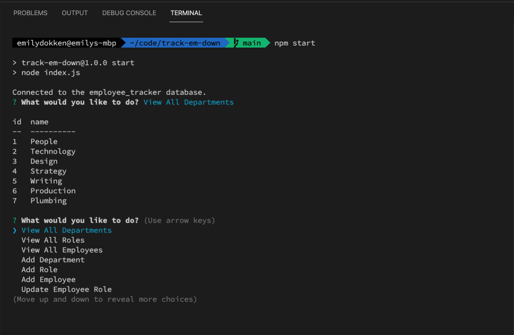

# Track Em Down

## Description

This is an employee tracker using MySQL to store information about employees at a company. Use the node package Inquirer, you can use terminal to search the MySQL database to View All Departments, View All Roles, View All Employees, Add a new Department, Add a new role, Add an Employee, or update an employee.

## Table of Contents (Optional)

If your README is long, add a table of contents to make it easy for users to find what they need.

- [Installation](#installation)
- [Usage](#usage)
- [Credits](#credits)
- [License](#license)

## Installation

To run you will need to pull down the repo, then
- npm init
- npm install
- update your local .env file to use your MySQL username and password

## Usage

To use this application, you will run `npm start` after following Installation Instructions

Video example: https://watch.screencastify.com/v/RNMvA43Z6s8E8LzfQosq

Screenshot of application:

## Credits

- [MySQL2](https://www.npmjs.com/package/mysql2)
- [dotenv](https://www.npmjs.com/package/dotenv)

## License

MIT License

Copyright (c) [2022] [Emily Dokken]

Permission is hereby granted, free of charge, to any person obtaining a copy
of this software and associated documentation files (the "Software"), to deal
in the Software without restriction, including without limitation the rights
to use, copy, modify, merge, publish, distribute, sublicense, and/or sell
copies of the Software, and to permit persons to whom the Software is
furnished to do so, subject to the following conditions:

The above copyright notice and this permission notice shall be included in all
copies or substantial portions of the Software.

THE SOFTWARE IS PROVIDED "AS IS", WITHOUT WARRANTY OF ANY KIND, EXPRESS OR
IMPLIED, INCLUDING BUT NOT LIMITED TO THE WARRANTIES OF MERCHANTABILITY,
FITNESS FOR A PARTICULAR PURPOSE AND NONINFRINGEMENT. IN NO EVENT SHALL THE
AUTHORS OR COPYRIGHT HOLDERS BE LIABLE FOR ANY CLAIM, DAMAGES OR OTHER
LIABILITY, WHETHER IN AN ACTION OF CONTRACT, TORT OR OTHERWISE, ARISING FROM,
OUT OF OR IN CONNECTION WITH THE SOFTWARE OR THE USE OR OTHER DEALINGS IN THE
SOFTWARE.